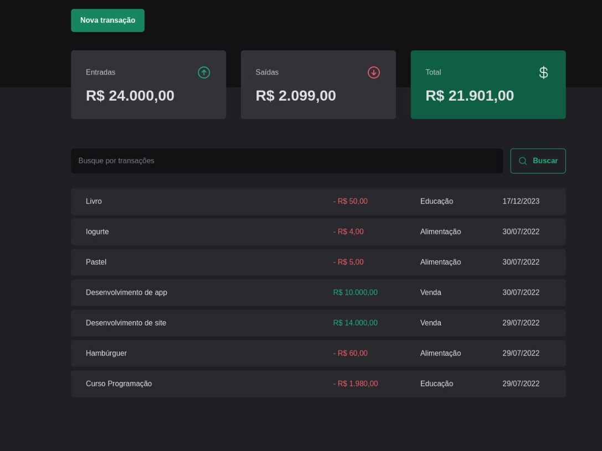
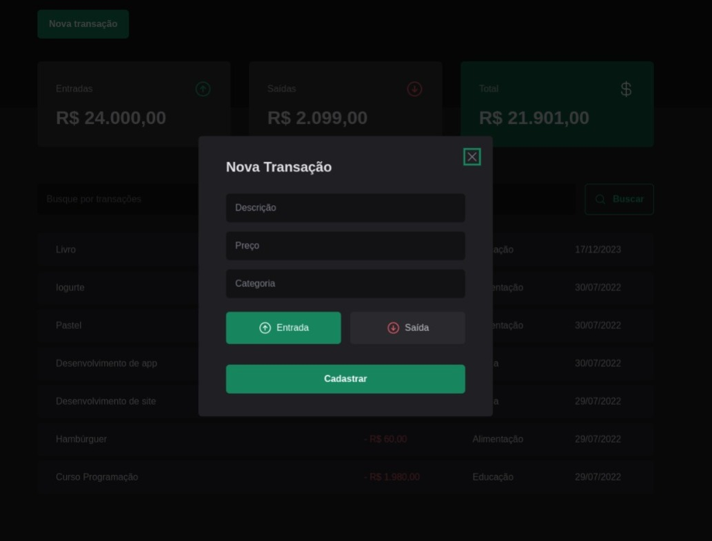

# DT MONEY

Este é um projeto de controle financeiro desenvolvido em React e TypeScript. Ele permite o registro de entradas e saídas financeiras, cálculo do total, busca, filtros e inclui recursos de acessibilidade.




## Funcionalidades Principais

- **Adição de Transações:** Registre suas transações financeiras, especificando se são entradas ou saídas, a categoria, e o valor.

- **Cálculo Automático do Total:** A aplicação realiza automaticamente o cálculo do total com base nas transações registradas.

- **Busca e Filtros:** Utilize a funcionalidade de busca para encontrar transações específicas. Além disso, aplique filtros para organizar as transações por categoria, data, ou outro critério relevante.

- **Acessibilidade:** O projeto prioriza a acessibilidade, garantindo uma experiência inclusiva para todos os usuários.

## Tecnologias Utilizadas

O projeto está sendo desenvolvido utilizando as seguintes tecnologias:

- React
- TypeScript


## Instalação

Siga os passos abaixo para instalar e executar o projeto localmente:

1. **Clone o Repositório:**
   ```bash
   git clone https://github.com/devGabyAlves/dt-money.git
   cd dt-money

2. **Instale as dependêndencias:**
    ```bash
    npm install

3. **Execute a Aplicação:**
    ```bash
    npm run dev